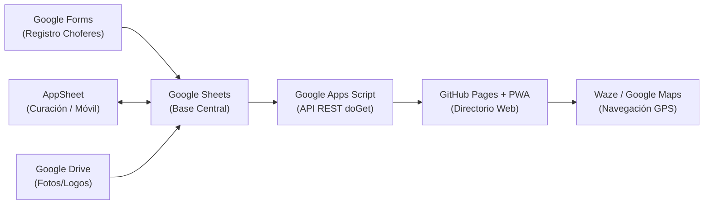

# 🚚 Rutas CR — Directorio de Transportistas de Encomiendas

[](https://sh2658.github.io/directorio-transportistas-/)
[](./manifest.json)
[](./LICENSE)

Directorio web moderno y comunitario para encontrar transportistas de encomiendas y carga en **Costa Rica**. Permite buscar por destino o empresa, calcular distancias por GPS y navegar directamente a las bodegas con **Waze** o **Google Maps**.

🌐 **Sitio Web Público:** [https://sh2658.github.io/directorio-transportistas-/](https://sh2658.github.io/directorio-transportistas-/)

---

## 🏗️ Arquitectura de la Solución

El sistema opera con una arquitectura **Serverless Jamstack a Costo Cero**:



1. **Frontend (GitHub Pages):** Single Page Application (SPA) ultra rápida con caché local instantánea (`localStorage`), mapa interactivo Leaflet.js y diseño responsive tipo boleto.
2. **Backend API (Google Apps Script):** Endpoint `doGet` que lee la hoja de cálculo, valida permisos y entrega JSON estructurado en UTF-8.
3. **Base de Datos (Google Sheets):** Almacén central de datos conectado al formulario público de actualización.
4. **App Administrativa (AppSheet):** Interfaz móvil y web para validación de datos, captura de coordenadas `LatLong` y moderación de transportistas.

---

## ✨ Características Principales

- **⚡ Carga Instantánea (0 ms):** Estrategia de caché *Stale-While-Revalidate* (SWR). El directorio carga de inmediato desde `localStorage` mientras sincroniza en segundo plano.
- **💬 WhatsApp con Detección Celular (+506):** Identifica automáticamente líneas celulares (6, 7 y 8 según plan SUTEL), antepone el código internacional de Costa Rica y abre el chat con mensaje prellenado.
- **🗺️ Navegación Inteligente (App Nativa o Web):** Enlaces con *Android Intents* y *Universal Links* que abren las apps nativas de **Waze** o **Google Maps** si están instaladas, y si no, abren fluidamente su versión web de navegación.
- **📍 Geolocalización y Proximidad:** Ordena las bodegas por distancia en kilómetros (fórmula de Haversine) según el GPS del usuario.
- **🔍 Búsqueda Inteligente (Fuzzy Search):** Algoritmo de distancia de Levenshtein y normalizador fonético que repara textos con tildes ausentes (`PREZ ZELEDN` → `Pérez Zeledón`).
- **📱 PWA (Progressive Web App):** Instalable en teléfonos Android e iPhone como una app nativa con soporte de caché offline (`sw.js`).
- **🆓 Cero Costos de Google Cloud:** Mapa embebido basado en OpenStreetMap + Leaflet, sin claves de API expuestas ni consumo de cuotas de facturación.

---

## 📂 Estructura del Repositorio

```text
directorio-transportistas-/
├── index.html                    # Frontend SPA principal (HTML5 + CSS + JS)
├── manifest.json                 # Configuración de Progressive Web App (PWA)
├── README.md                     # Documentación general del proyecto
│
├── apps_script/                  # Código fuente de Google Apps Script
│   ├── Codigo_AppsScript_API.js  # API REST doGet con salida UTF-8
│   └── Geocodificador_OpenCage.js# Script para rellenar lat/lng automáticamente
│
└── docs/                         # Guías técnicas y manuales de integración
    └── INTEGRACION_APPSHEET.md   # Configuración de AppSheet y flujo de aprobación
```

---

## 🚀 Despliegue y Mantenimiento

1. **Actualizar el Frontend:**
   - Realiza cambios en `index.html` o `manifest.json`.
   - Haz commit y push a la rama `main` de GitHub.
   - GitHub Pages actualizará el sitio automáticamente en 1-2 minutos.

2. **Actualizar la API de Apps Script:**
   - Copia el código de `apps_script/Codigo_AppsScript_API.js`.
   - Pégalo en tu proyecto de [Google Apps Script](https://script.google.com/).
   - Pulsa **Implementar > Nueva implementación > Aplicación web**.
