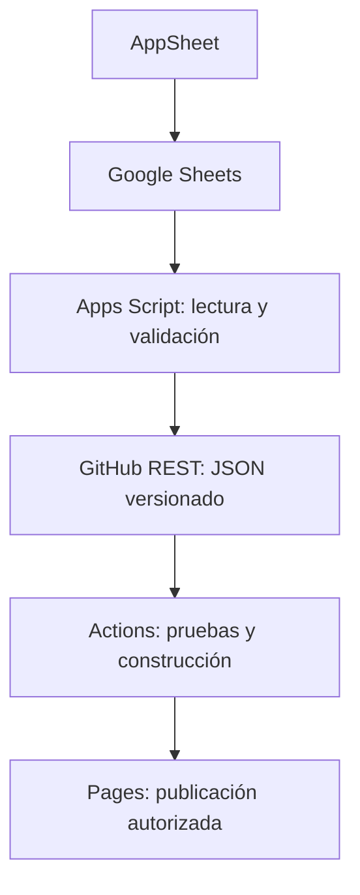

# Rutas CR — implementación y puesta en marcha

Estado: revisión preparada en rama aislada; producción NO reactivada. Código base revisado: ca2fe2a4105a731e90e7dce33166860fba7240ca. No se sustituyó el Apps Script instalado ni se modificaron columnas de AppSheet/Sheets.

## Arquitectura



Sheets conserva la autoridad sobre los datos. El JSON es una proyección pública de solo lectura; nunca se importa de vuelta a Sheets. No se usa IA para unir destinos ni se infiere identidad por GPS. Se conserva cada ID existente. Dos empresas en un mismo plantel mantienen sus teléfonos y destinos separados.

El proyecto de sincronización debe ser **independiente** del procesador de capturas. Añadir `RutasCR_Data.js` como `RutasCR_Data.gs`, `RutasCR_Sync.gs` y usar `appsscript.sync.json` como `appsscript.json`. Esto evita colisiones con `CONFIG`, `onOpen` o `doGet` de los scripts anteriores. Los archivos antiguos se conservan por compatibilidad/historial; no instalarlos todos juntos.

## Hallazgos comprobados

| Superficie | Evidencia | Corrección preparada |
|---|---|---|
| API en repositorio | `Codigo_AppsScript_API.js` espera una tabla plana `Transportistas`, cae a la primera pestaña y busca encabezados por coincidencia parcial. La base real es relacional. | Lectura exacta de cinco tablas; unión por IDs, encabezados obligatorios, bloqueo ante duplicados y referencias huérfanas. |
| Frontend base | Usa Google Maps aunque README anunciaba Leaflet. La descarga del directorio depende de `initMap`. | Carga independiente del JSON; Leaflet y marcador agrupado cargan al pedir mapa. |
| Búsqueda | Datos concatenados mediante `innerHTML`; búsqueda aproximada puede ampliar destinos sin advertencia. | DOM con `textContent`, URLs verificadas, coincidencia exacta prioritaria, parcial como segundo criterio. |
| Mapas | Marcadores sin agrupación; interacción predeterminada de Google Maps. | Leaflet.markercluster; rueda bloqueada inicialmente y al salir; activación explícita; controles visibles. |
| Orientación | Manifiesto `portrait-primary`. | `any`; tamaños intrínsecos, `min-width:0`, padding de búsqueda y reglas por anchura/altura. |
| Caché | Worker v21 podía devolver HTML para recursos fallidos y no distinguía JSON del contenido cacheable. | Shell limitado; JSON por red; error y reintento visibles; no directorio obsoleto servido offline. |
| Pruebas | Las diez pruebas iniciales fallaban al llamar funciones eliminadas por la restauración. | Pruebas sobre el contrato nuevo, aislamiento, DOM y cliente GitHub simulado. |

Esto NO prueba que el Apps Script desplegado sea idéntico al archivo del repositorio ni establece que Transkaja causó la corrupción. Para determinar esa causa faltan versiones/ejecuciones del proyecto instalado y el historial de cambios de la hoja. La coincidencia temporal por sí sola no es evidencia causal.

Lectura de Sheets actualizada: 54 transportistas, 74 filas de DIRECCION, 152 registros telefónicos, 415 lugares y 1007 relaciones VISITA. Sin claves duplicadas, nombres repetidos, relaciones duplicadas ni referencias huérfanas. El JSON público excluye 19 direcciones sin ZONA confirmada y publica 55 bodegas; 49 tienen coordenadas y seis quedan sin GPS. Una envolvente geográfica detecta errores obvios, pero NO verifica que una coordenada esté en la bodega correcta. El teléfono con ID `f865c02e` es de Panamá y se conserva con `507`.

## Archivos y comportamiento

- `index.html`: formulario accesible, estados de carga, resultados antes del formulario de altas, mapa opcional, diálogo nativo.
- `assets/css/app.css`: conserva colores y tarjetas del producto; reserva 58 px dentro del buscador y 44 px para la X; iOS usa fuente de 16 px y elimina el control nativo duplicado.
- `assets/js/core.js`: validación pública, búsqueda, Haversine y cuenta de operadores.
- `assets/js/app.js`: renderizado DOM, paginación de 15, imágenes diferidas, petición de GPS solo por acción del usuario, mapa y grupos. Todas las bodegas se conservan en la tarjeta.
- `assets/vendor/`: Leaflet 1.9.4 y markercluster 1.5.3, fijados y con licencias. Los mosaicos siguen dependiendo de OpenStreetMap; respetar su política de uso y elegir un proveedor de teselas si aumenta el tráfico.
- `data/transportistas.json`: instantánea actual preparada para revisión, schemaVersion 1, fecha, huella SHA-256 y transportistas. No contiene CAPTURAS, observaciones internas, correos ni claves API.
- `apps_script/RutasCR_Data.js`: constructor puro compartido con pruebas.
- `apps_script/RutasCR_Sync.gs`: cliente REST de GitHub, debounce, bloqueo, reintentos y activadores.
- `.github/workflows/verify.yml`: pruebas en ramas y PR.
- `.github/workflows/pages.yml`: construcción/publicación de main solo con `RUTAS_PAGES_ENABLED=true`.

El cluster cuenta empresas distintas, no bodegas. Al aumentar zoom muestra puntos individuales; en coordenadas idénticas los separa radialmente al abrir el grupo. Una empresa con varias bodegas en un cluster cuenta una vez. La lista permite contactar y navegar aunque no cargue el mapa.

## PAT y configuración exacta

1. GitHub → Settings → Developer settings → Personal access tokens → Fine-grained tokens.
2. Owner: `sh2658`. Repository access: **Only select repositories** → `directorio-transportistas-`.
3. Repository permissions: **Contents: Read and write**; Metadata: Read (implícito). No se necesita permiso Workflows para actualizar el JSON. Definir vencimiento y renovar antes de esa fecha.
4. Guardar el token exclusivamente en **Script Properties** del nuevo proyecto de Apps Script. No pegarlo en chat, HTML, JSON o repositorio. Los editores del proyecto pueden acceder a esas propiedades; limitar quién edita el proyecto.

| Script Property | Valor inicial |
|---|---|
| RUTAS_SHEET_ID | `1gXtF2KcCuy_cdYRNTbGrulNbB5SYw_mrN-H_AVSXOeA` |
| RUTAS_GITHUB_OWNER | `sh2658` |
| RUTAS_GITHUB_REPO | `directorio-transportistas-` |
| RUTAS_GITHUB_BRANCH | Rama de ensayo existente; después `main` |
| RUTAS_GITHUB_PAT | Token privado |
| RUTAS_SYNC_ENABLED | `false` durante preparación |
| RUTAS_PUBLIC_DATA_APPROVED | `false` hasta revisar campos/datos públicos |
| RUTAS_PUBLIC_IMAGE_URLS | Opcional: objeto JSON `{ "IDTRANSPORTE": "https://.../imagen.jpg" }` |

Ejecutar `rutasCRDiagnosticar()` y revisar Execution log. Luego ejecutar `rutasCRInstalar()` y autorizar lectura de Sheets, activadores y UrlFetch. Esta instalación no cambia el interruptor de sincronización. Para ensayar, establecer `RUTAS_PUBLIC_DATA_APPROVED=true` y `RUTAS_SYNC_ENABLED=true`, apuntando a una **rama no publicada**.

La primera lectura estable devuelve `settling`; una ejecución posterior con el mismo contenido y al menos 60 segundos transcurridos escribe el JSON. El activador de cinco minutos detecta también cambios de AppSheet y API: latencia normal aproximada 5–10 minutos, más cola de Google/GitHub. No es tiempo real ni SLA. Un cambio directo en Sheets adelanta la observación del candidato. Las llamadas API/scripts NO disparan onEdit por sí mismas.

Opcional: AppSheet Automation, evento Adds/Updates/Deletes en las cinco tablas → tarea **Call a script** → `rutasCRDesdeAppSheet()` en el proyecto independiente. Comprobar disponibilidad según el plan. Se mantiene el reloj como reconciliación; no se necesita un webhook anónimo ni secreto en URL. Las modificaciones externas a AppSheet no disparan necesariamente sus bots.

## Protección del JSON y fallos

- `ScriptLock` evita escritores concurrentes de este proyecto; AppSheet no comparte ese bloqueo. Dos lecturas y observaciones estables reducen snapshots parciales, pero Sheets no es una base transaccional. Con escrituras masivas, pausar `RUTAS_SYNC_ENABLED`, completar revisión y reactivarlo.
- Antes de PUT, GET del archivo para obtener `sha`. Contenido en Base64 UTF-8; el PUT incluye `branch` y `sha` en actualizaciones. HTTP 200/201 es éxito. Ante 409 se relee y reintenta hasta tres veces. 401/403/422 y errores temporales se registran y se reintentan en un próximo ciclo; no se declaran éxito.
- No hay commit cuando el contenido permanece igual. Fecha de exportación se cambia solo al escribir; no causa commits cada cinco minutos.
- Claves duplicadas, destinos repetidos, teléfonos inválidos o GPS inválidos bloquean el commit. GPS vacío conserva la bodega y no crea un enlace de navegación.
- Reducciones de transportistas, destinos, bodegas o teléfonos se bloquean. Tras revisar una eliminación legítima, copiar el hash de `rutasCRDiagnosticar()` a `RUTAS_APPROVED_DELETION_HASH`. La autorización se consume después de ese commit.
- Límite preventivo de 900 KB por JSON para poder releerlo por Contents API; escalar a archivos segmentados/Git Data API al crecer.
- Consultar `RUTAS_LAST_ERROR`, `RUTAS_LAST_OK` y `RUTAS_LAST_COMMIT` en Script Properties. Revisar avisos de fallo de activadores. No se instalaron estos activadores durante esta revisión.
- Ante un fallo de construcción, Pages mantiene la versión anterior. Para una baja urgente de información pública, detener publicación y retirar el sitio; no depender de un build fallido como mecanismo de retirada.

## Imágenes: pendiente antes de lanzamiento

48 registros contienen rutas relativas de AppSheet, que no son URLs públicas utilizables desde GitHub Pages. No se desactivó la firma de imágenes ni se abrieron permisos de Drive. La instantánea usa `imagen: ""` para esos casos y la UI indica “Imagen no disponible”.

Solución: preparar copias públicas seleccionadas de los logos/afiches en `assets/transportistas/` (o un host de imágenes), manteniendo los originales y la firma de AppSheet. Configurar el mapa ID → URL HTTPS final en `RUTAS_PUBLIC_IMAGE_URLS`. Comprobar cada imagen sin sesión y no usar un enlace a la página de Drive como si fuese el archivo de imagen. Si el mapa crece más allá del límite de una propiedad de Apps Script, trasladarlo a un archivo de configuración privado o una columna pública explícita mediante una migración revisada.

## AppSheet: referencias y selector de lugares

No se aplicaron cambios al editor en esta revisión: acceso visual bloqueado. Revisar en la copia de prueba:

| Tabla/columna | Configuración |
|---|---|
| TRANSPORTISTA.IDTRANSPORTE | Text, Key, Initial value `UNIQUEID()`, no App formula, no _RowNumber |
| TRANSPORTISTA.TRANSPORTE | Label |
| LUGARES.IDLUGARES | Text, Key, Initial value `UNIQUEID()` |
| LUGARES.LUGAR | Label |
| VISITA.IDVISITA | Text, Key, Initial value `UNIQUEID()` |
| VISITA.IDTRANSPORTE | Ref → TRANSPORTISTA, requerido |
| VISITA.IDLUGARES | Ref → LUGARES, requerido |

No recalcular IDs existentes. Para `VISITA[IDLUGARES]`, probar este `Valid_If` en el formulario de VISITA:

```appsheet
LUGARES[IDLUGARES]
-
SELECT(
  VISITA[IDLUGARES],
  AND(
    [IDTRANSPORTE] = [_THISROW].[IDTRANSPORTE],
    [IDVISITA] <> [_THISROW].[IDVISITA]
  )
)
```

Devuelve IDs, muestra los Labels y excluye únicamente lugares ya asignados al transportista actual. Permite conservar el lugar de la fila que se edita. Si un lugar todavía no aparece, revisar que exista en LUGARES, security filters y slices, sincronización y valores de `Suggested values`/`Valid_If`; no asumir que el desplegable lo elimina por un solo motivo.

Presentación deseada:

| Contexto | Mostrar en filas | Agrupar |
|---|---|---|
| Detalle de un transportista | LUGAR | Sin agrupación por transportista; ya está en la cabecera |
| Detalle de un lugar | TRANSPORTE | Sin repetir LUGAR por fila |
| Directorio general por zona/lugar | TRANSPORTE | Group by IDLUGARES; ocultar IDLUGARES en Column order |

Usar vistas Ref específicas y, si el generador reutiliza VISITA_Inline para ambos contextos, slices/vistas separadas. Comprobar su resolución real en preview antes de sustituir la vista usada. Para la tabla VISITA, `REF_ROWS("VISITA", "IDTRANSPORTE")` produce hijos del transportista y `REF_ROWS("VISITA", "IDLUGARES")` los del lugar. No cambiar estas relaciones por búsquedas de texto.

Caso de aceptación: añadir un destino a Empresa A, sincronizar, comprobar una sola fila VISITA, verificar que Empresa B no lo adquiere, comprobar que el exportador cambia solo A y que el frontend lo encuentra únicamente por ese destino.

## Puerta de despliegue

1. Mantener Pages suspendido. Revisar y combinar la rama de correcciones solo después de resolver pendientes.
2. En GitHub Pages seleccionar **GitHub Actions**, no publicación automática de una carpeta por rama. Esto es imprescindible para que las pruebas puedan impedir la publicación.
3. Crear variable de repositorio `RUTAS_PAGES_ENABLED=false`. Configurar el environment `github-pages` para main y, si se desea, revisión de despliegue. Reglas de protección de main deben permitir la escritura del JSON por el actor autorizado o usar rama de datos con PR; el PAT no evade branch protection.
4. Completar prueba real de Apps Script → rama de ensayo → JSON, comprobación de imágenes, selector de AppSheet y matriz visual.
5. Solo entonces apuntar sincronización a main y cambiar `RUTAS_PAGES_ENABLED=true`. Un commit del PAT sobre main inicia Actions, ejecuta pruebas/construcción y publica el artefacto permitido. No subir `.local`, Apps Script ni tablas crudas al artefacto de Pages.
6. Verificar URL pública, una búsqueda, teléfono, imagen y navegación. Un token `GITHUB_TOKEN` de Actions tiene restricciones de encadenamiento; este diseño usa el PAT desde Apps Script.

Reversión: pausar `RUTAS_SYNC_ENABLED`, poner `RUTAS_PAGES_ENABLED=false`, revertir el commit defectuoso de frontend/datos y probar. No restaurar la hoja completa para revertir solo un defecto de interfaz.

## Verificación realizada y límites

Comandos ejecutados: `npm test`, `npm run build`. Pruebas locales de contrato, DOM (jsdom) y mocks de Apps Script/GitHub. NO constituyen ensayos reales de Safari/iOS, Android, pantalla ni autorización remota.

Matriz pendiente: Chrome/Edge en Windows, Safari en Mac e iPhone, Chrome Android; 320/375/390/768/1024/1440 px; retrato y paisaje; teclado visible, texto largo, zoom de texto 200%, teclado sin ratón, imagen fallida, datos vacíos, red lenta, 2 empresas con mismas coordenadas, una empresa con 2 bodegas en el mismo cluster y rechazo de geolocalización. Verificar ausencia de desbordamiento horizontal real, clusters y foco de diálogo.

No se pudo capturar el flujo visual actual: la revisión automática rechazó el acceso al navegador local por límite de uso. Por tanto, los hallazgos UX de este documento son revisión de código, no una auditoría visual completa. No se utilizaron mecanismos alternativos para eludir ese bloqueo.

## Referencias oficiales

- [Activadores Apps Script](https://developers.google.com/apps-script/guides/triggers/installable)
- [REST Contents de GitHub](https://docs.github.com/en/rest/repos/contents)
- [PAT de alcance limitado](https://docs.github.com/en/authentication/keeping-your-account-and-data-secure/managing-your-personal-access-tokens)
- [GitHub Pages con Actions](https://docs.github.com/en/pages/getting-started-with-github-pages/using-custom-workflows-with-github-pages)
- [Leaflet](https://leafletjs.com/reference.html)
- [Leaflet.markercluster](https://leaflet.github.io/Leaflet.markercluster/)
- [AppSheet Call a script](https://support.google.com/appsheet/answer/11997142?hl=en)
- [Imágenes AppSheet](https://support.google.com/appsheet/answer/10107317?hl=en)
